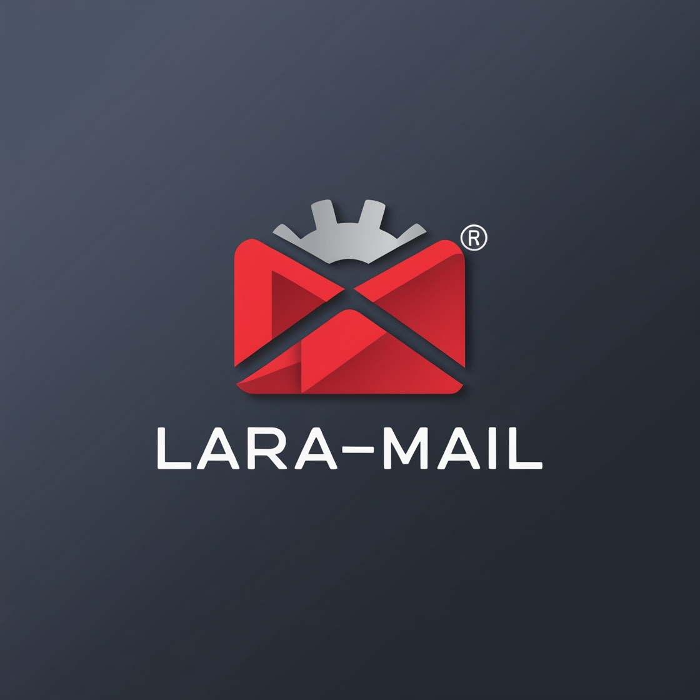

<div align="center">
    
  <h1 style="color: red;"> <\> Lara-Mail <\> </h1>
</div>

---

## 📧 Intro

**Lara-Mail** is a lightweight, elegant email-sending web application built with Laravel. Designed for simplicity and efficiency, it provides a clean interface to send emails effortlessly, complete with loading animations and pop-up notifications for enhanced user experience.

---

## 🚀 Features

- **Dynamic Email Sending**: Easily send customized emails with a subject, body, and recipient information.

- **Responsive Design**: Clean, mobile-friendly UI styled with Tailwind CSS.

- **Laravel Blade Templates**: Reusable components for quick development.

- **Customizable Email Templates**: Beautiful, professional email designs ready for use.

- **File attachment**: supports file attachment up to 5MB to send docs, ppt, image and pdf.

---

## 💻 Test

- **For the web view**: the web app is accessible at http://127.0.0.1:8000/send URL.

- **For REST api**: use http://127.0.0.1:8000/api/send URL.

    the json format is like this:
    ```json
    {
        "recipient": "emailaddress@mail.com",
        "subject": "Subject of the Email",
        "body": "body of the message!",
        "contact_info": "sender address (links)"
    }
    ```
    use form data if you want to attach files and use key "attachment" for the file.
    **if you want to tryout file attachement:** try the 'dev' branch.

---

## 🛠️ Installation

Follow these steps to get the project running locally:

1. **Clone the repository**:
   ```bash
   git clone https://github.com/BekaMan95/lara-mail.git lara-mail
   ```
    ```bash
   cd lara-mail
    ```

2. **Install Dependencies**:
    install composer dependencies,
   ```bash
   composer install
    ```
    install node dependencies,
    ```bash
    npm install
    ```
    create storage link,
    ```bash
    php artisan storage:link
    ```

3. **Set up your environment**:
    Copy .env.example to .env:
    ```bash
    cp .env.example .env
    ```
    Configure your environment variables in .env. Here’s an example for setting up email:
    ```php
    MAIL_MAILER=smtp
    MAIL_HOST=smtp.gmail.com
    MAIL_PORT=587
    MAIL_USERNAME=youremailaddress@gmail.com
    MAIL_PASSWORD=email.token
    MAIL_ENCRYPTION=tls
    MAIL_FROM_ADDRESS="youremailaddress@gmail.com"
    MAIL_FROM_NAME="${APP_NAME}"

    ```

4. **Generate application key**:
    ```bash
    php artisan key:generate
    ```

5. **Build UI Components**:
    ```bash
    npm run build
    ```
    alternatively, if you just want a taste, use 'run dev' on separate terminal.
    ```bash
    npm run dev
    ```

6. **Start the development server**:
    ```bash
    php artisan serve
    ```
    The application will now be accessible at http://127.0.0.1:8000.
